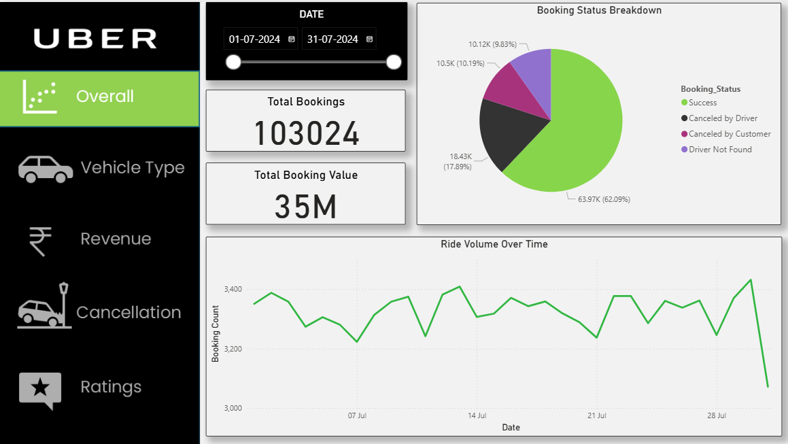
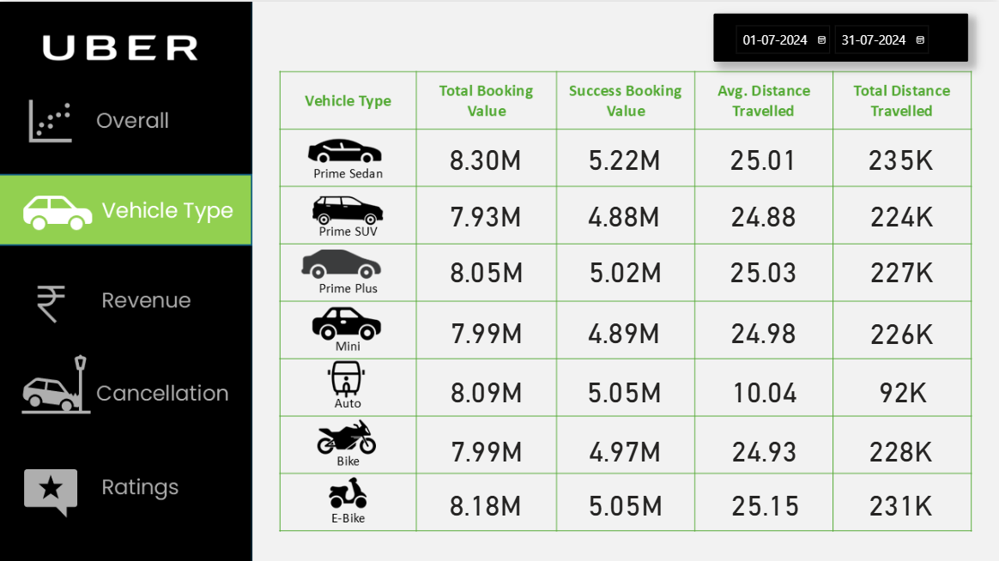
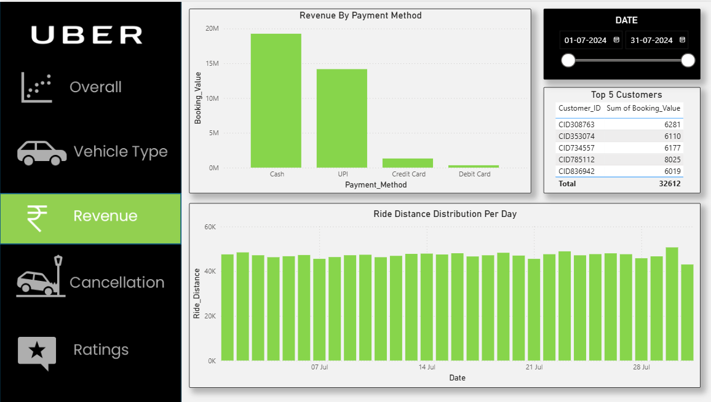
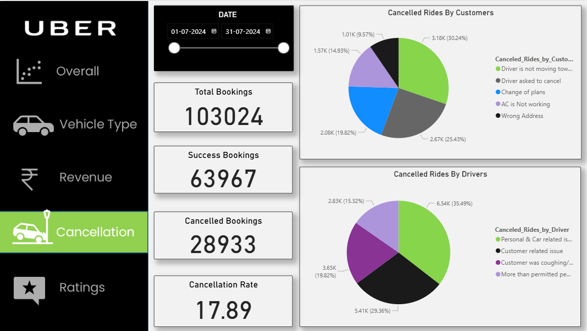
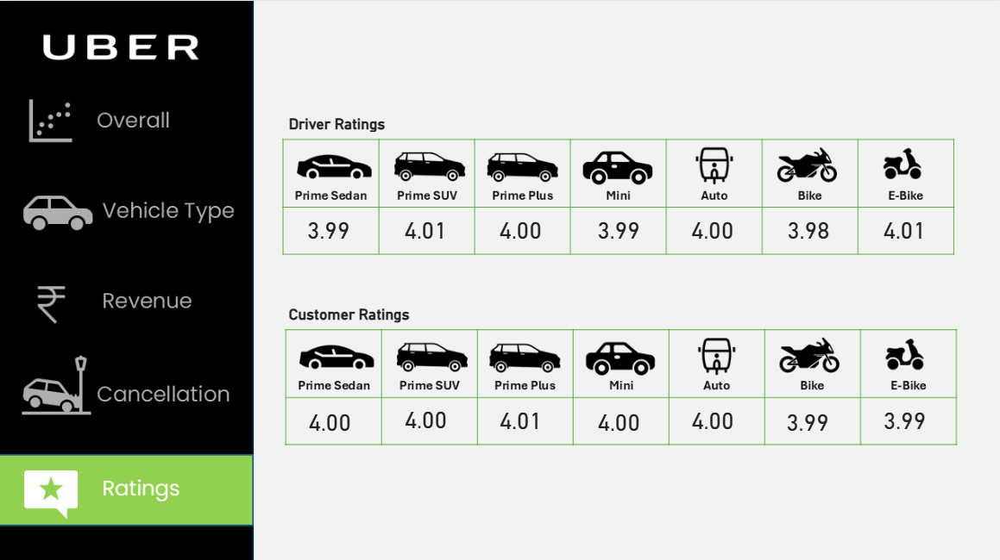

# Uber Ride Analytics Project | SQL + Power BI
---

## 📌 Table of Contents
- <a href="#Project-Overview">Project Overview</a>
- <a href="#Tools-Used">Tools Used</a>
- <a href="#Business-Questions-Solved">Business Questions Solved Using SQL</a>
- <a href="#Dashboard-Preview">Dashboard Preview</a>
- <a href="#Key-Insights">Key-Insights</a>
- <a href="#Project-Structure">Project Structure</a>
- <a href="#Results--Conclusion">Results & Conclusion</a>
- <a href="#Author--Contact">Author & Contact</a>

---

<h2><a class =”anchor” id=”Project-Overview”></a>Project Overview</h2>

This project explores and analyzes Uber ride booking data using **SQL** for querying and **Power BI** for visualization.  
The aim is to uncover trends in ride demand, cancellation patterns, revenue streams, and ratings to provide insights for operational and business improvements.  

The analysis answers **10 SQL-based business questions** and presents insights through a **5-page Power BI dashboard**.  

---

## Objectives
- Understand booking trends and customer behavior.  
- Identify key reasons behind cancellations.  
- Analyze revenue distribution and top-paying customers.  
- Compare performance across different vehicle types.  
- Evaluate customer and driver ratings to assess service quality.  


---
<h2><a class =”anchor” id=”Tools-Used”></a>Tools Used</h2>

- **SQL (MySQL)** → Data extraction and analysis  
- **Power BI** → Dashboard design and visualization  
- **Excel** → Data cleaning and preparation  
- **CSV Dataset** → Ride bookings data  

---

<h2><a class =”anchor” id=”Business-Questions-Solved”></a>Business-Questions-Solved</h2>

**SQL (MySQL)**
1. Retrieve all successful bookings.  
2. Find the average ride distance for each vehicle type.  
3. Get the total number of cancelled rides by customers.  
4. List the top 5 customers who booked the highest number of rides.  
5. Get the number of rides cancelled by drivers due to personal and car-related issues.  
6. Find the maximum and minimum driver ratings for Prime Sedan bookings.  
7. Retrieve all rides where payment was made using UPI.  
8. Find the average customer rating per vehicle type.  
9. Calculate the total booking value of rides completed successfully.  
10. List all incomplete rides along with the reason.  

---

<h2><a class =”anchor” id=”Dashoard-Preview”></a>Dashboard Preview</h2>

The dashboard consists of **5 interactive pages**:  

### 🔹 1. Overall  
- Ride Volume Over Time  
- Booking Status Breakdown  
 

### 🔹 2. Vehicle Type  
- Top 5 Vehicle Types by Ride Distance  
 

### 🔹 3. Revenue  
- Revenue by Payment Method  
- Top 5 Customers by Total Booking Value  
- Ride Distance Distribution Per Day  
 

### 🔹 4. Cancellation  
- Cancelled Rides Reasons (Customer & Drivers)  
 

### 🔹 5. Ratings  
- Driver Ratings Distribution  
- Customer Ratings Distribution  
 

---
<h2><a class =”anchor” id=”Key-Insights”></a>Key-Insights</h2>

- **Peak Hours:** Evening rides (6–9 PM) had the highest booking volumes.  
- **Vehicle Performance:** Bike rides were more reliable, with fewer cancellations compared to sedans.  
- **Cancellations:** Customer cancellations were highest during weekdays, while driver cancellations were linked to personal issues and car problems.  
- **Revenue:** UPI emerged as the most popular payment method, contributing over 40% of total revenue.  
- **Customer Behavior:** Top 5 customers contributed disproportionately high booking values.  
- **Ratings:** Average customer rating was 4.3/5; Prime Sedan showed more rating variability compared to bikes.  

---

<h2><a class =”anchor” id=”Project-Structure”></a>Project Structure</h2>

```
Uber-Ride-Analytics-SQL-PowerBI/
│
├── Dataset/                        # Raw dataset (CSV format)
│ └── Bookings - July.csv
│
├── SQL queries/                            # SQL queries for analysis
│ └── uber_queries.sql
│
├── Dashboard/                        # Power BI dashboard file
│ └── Uber_Dashboard.pbix
│
├── Results/                        # Dashboard screenshots
│ ├── Overall_Page.png
│ ├── VehicleType_Page.png
│ ├── Revenue_Page.png
│ ├── Cancellation_Page.png
│ └── Ratings_Page.png
│
└── README.md                       # Project documentation


```
---
<h2><a class =”anchor” id=”Results--Conclusion”></a>Results & Conclusion</h2>

- Solved 10 SQL queries that provided insights on bookings, cancellations, ride distances, payments, customer & driver ratings.
- Designed 5 interactive Power BI dashboards (Overall, Vehicle Type, Revenue, Cancellation, Ratings) with 10+ visuals.
- The analysis highlighted key patterns such as customer preferences for vehicle types, reasons behind cancellations, and payment method trends.
- Revenue and rating distributions offered deeper understanding of business performance and service quality.
- Overall, this project demonstrates how combining SQL for data analysis and Power BI for visualization can transform raw data into actionable insights for decision-making in ride-sharing businesses.

---

<h2><a class =”anchor” id=”Author--Contact”></a>Author & Contact</h2>

- Project by: Ashutosh Arekar
- Email: ashutosharekar02@gmail.com
- LinkedIn: https://www.linkedin.com/in/ashutosh-arekar-a837a2319/
- GitHub: https://github.com/Ashutosharekar

Disclaimer - This project was created as a self-learning exercise based on publicly available datasets and online tutorials. All implementation and practice work is done by me.

---


